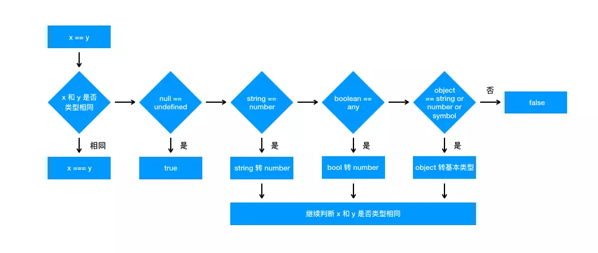

# 数据结构和类型

[[toc]]

## 数据类型

包括 7 种**基本数据类型和对象**。

| 类型                     |                                                                  |
| ------------------------ | ---------------------------------------------------------------- |
| 字符串（String)          | 字符串是一串表示文本值的字符序列                                 |
| 布尔值（Boolean）        | true / false                                                     |
| 数字（Number）           | 整数或浮点数                                                     |
| 任意精度的整数（BigInt） | 可以安全地存储和操作大整数，甚至可以超过数字的安全整数限制       |
| null                     | 一个表明 null 值的特殊关键字                                     |
| undefined                | 和 null 一样是一个特殊的关键字，undefined 表示变量未赋值时的属性 |
| Symbol                   | 一种实例是唯一且不可改变的数据类型                               |
| Object                   | 对象                                                             |

## 判断类型

### typeof

::: tip 提示
返回值都为字符串类型
:::

- 一共可以返回 7 个值；
- 未定义的变量会返回“undefined”；
- 对于引用类型，除 function 以外，一律返回 object 类型；
- null 返回的值是“object”；
- 对于数组、日期、正则和 null 不能正确返回详细类型；

```js
console.log(typeof 123); // number
console.log(typeof "hello"); // string
console.log(typeof true); // boolean
console.log(typeof { firstName: "gg" }); // object
console.log(typeof null); // object
console.log(typeof [123]); // object
console.log(typeof undefined); // undefined
console.log(typeof function foo() {}); // function
console.log(typeof Symbol()); // symbol
```

### instanceof

instanceof 是用来判断 A 是否为 B 的实例，表达式为：A instanceof B，如果 A 是 B 的实例，则返回 true,否则返回 false。

```js
console.log([] instanceof Array); // true
console.log([] instanceof Object); // true
```


[] 的 `__proto__ ` 直接指向 Array.prototype，间接指向 Object.prototype，所以按照 instanceof 的判断规则，[] 就是 Object 的实例。依次类推，类似的 new Date()、new Person() 也会形成一条对应的原型链 。因此，**instanceof 只能用来判断两个对象是否属于实例关系， 而不能判断一个对象实例具体属于哪种类型。**

可以用 Array.isArray() 确认某个对象本身是否为 Array 类型。Array.isArray() 本质上检测的是对象的 [[Class]] 值，[[Class]] 是对象的一个内部属性，里面包含了对象的类型信息，其格式为 [object Xxx] ，Xxx 就是对应的具体类型 。对于数组而言，[[Class]] 的值就是 [object Array] 。

### constructor

constructor 指向构造函数本身。

```js
console.log([].constructor === Array); // true
```

null 和 undefined 是无效的对象，因此是不会有 constructor 存在的，这两种类型的数据需要通过其他方式来判断；

函数的 constructor 是不稳定的，这个主要体现在自定义对象上，当开发者重写 prototype 后，原有的 constructor 引用会丢失，constructor 会默认为 Object；

### toString（推荐）

toString() 是 Object 的原型方法，调用该方法，默认返回当前对象的 [[Class]] 。这是一个内部属性，其格式为 [object Xxx] ，其中 Xxx 就是对象的类型。

::: tip 提示
对于 Object 对象，直接调用 toString() 就能返回 [object Object] 。而对于其他对象，则需要通过 call / apply 来调用才能返回正确的类型信息。
:::

```js
console.log(Object.prototype.toString.call("")); // [object String]
console.log(Object.prototype.toString.call(1)); // [object Number]
console.log(Object.prototype.toString.call(true)); // [object Boolean]
console.log(Object.prototype.toString.call(Symbol())); // [object Symbol]
console.log(Object.prototype.toString.call(undefined)); // [object Undefined]
console.log(Object.prototype.toString.call(null)); // [object Null]
console.log(Object.prototype.toString.call(new Function())); // [object Function]
console.log(Object.prototype.toString.call(new Date())); // [object Date]
console.log(Object.prototype.toString.call([])); // [object Array]
console.log(Object.prototype.toString.call(new RegExp())); // [object RegExp]
console.log(Object.prototype.toString.call(new Error())); // [object Error]
```

## 类型转换

#### 字符串转换为数字 -->

类型转换有三种：分别是转换为字符串、转换为数字和转换为布尔值；

### 对象转换规则

对象在转换类型的时候，会调用内置的 `[[ToPrimitive]]` 函数，对于该函数来说，逻辑如下：

1. 如果已经是原始值，则不进行转换；
2. 否则，调用 `x.valueOf()`，如果转换为了基础类型，就返回转换后的值；
3. 否则，调用 `x.toString()`，如果转换为了基础类型，就返回转换后的值；
4. 以上都没有转换成原始值，报错；

### 四则运算符转换规则

#### 加法运算符

- 运算中其中一方为字符串，那么就会把另一方也转换为字符串；

```js
1 + "1"; // '11'
```

- 如果一方不是字符串或者数字，那么会将它转换为数字或者字符串；

```js
true + true; // 2
4 + [1, 2, 3]; // "41,2,3"  (先将数组通过`toString`转为字符串"1,2,3"，得到结果"41,2,3")
"a" + +"b"; // "aNaN"  (+ 'b'等于NaN，所以结果为"aNaN")
```

#### 其他四则运算符

- 对于其他运算符来说，只要其中一方是数字，那么另一方就会被转为数字；

```js
4 * "3"; // 12
4 * []; // 0
4 * [1, 2]; // NaN
```

### 比较运算符转换规则（==）

对于 `==` 来说，如果对比双方的类型**不一样**的话，就会进行**类型转换**。

假如我们需要对比 `x` 和 `y` 是否相同，就会进行如下判断流程：



1. 首先会判断两者类型（===）是否**相同**，相同的话就是比大小了；

2. 类型不相同的话，那么就会进行类型转换

3. 先判断是否在对比 `null` 和 `undefined` ，是的话就会返回 `true` ；

4. 判断两者类型是否为 `string` 和 `number` ，是的话就会将字符串转换为 `number` ；

   ```js
   1 == '1'
         ↓
   1 ==  1
   ```

5. 判断其中一方是否为 `boolean` ，是的话就会把 `boolean` 转为 `number` 再进行判断；

   ```js
   '1' == true
           ↓
   '1' ==  1
           ↓
    1  ==  1
   ```

6. 判断其中一方是否为 `object` 且另一方为 `string` 、 `number` 或者 `symbol` ，是的话就会把 `object` 转为原始类型再进行判断

   ```js
   '1' == { name: 'yck' }
                ↓
   '1' == '[object Object]'
   ```

::: tip 提示
除了 `undefined`，`null`，`false`，`NaN`，`''`，`0`，`-0`，其他所有值都转为 `true`，包括所有对象；
:::

::: tip 提示
parseInt(string,radix)可以把目标进制转换成十进制；

string.toString(radix)可以把十进制转换成目标进制；
:::

::: tip 提示
undefined == null;	
	
undefined !== null;  
(两个都不大于0，不小于0也不等于0)

:::

::: tip 提示
NaN不等于NaN，用Object.is(NaN,NaN)判断

===（绝对等于）和 !==(绝对不等于)不发生类型转换
:::

